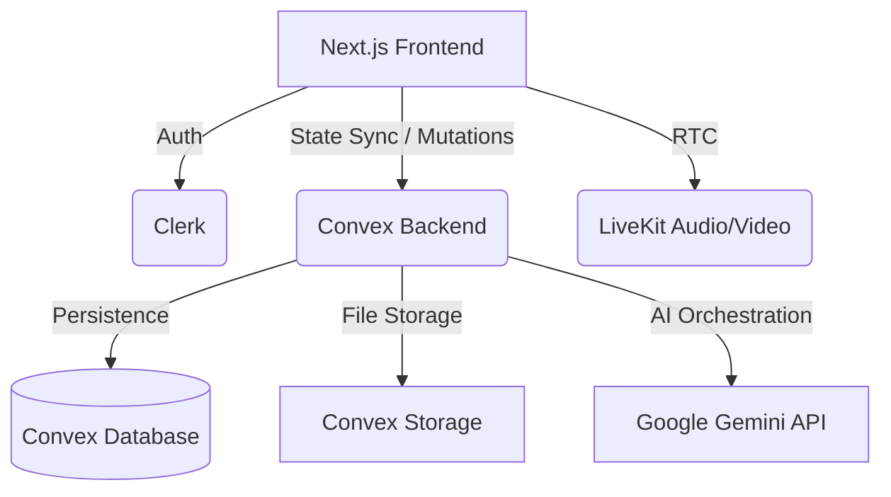

# ⚡ Pulse - System Architecture

Pulse is a state-of-the-art, real-time chat platform engineered for high-performance communication. It leverages a modern, serverless stack to provide a seamless, low-latency experience across all devices.

---

## 🏗️ High-Level Architecture

The platform follows a **Client-Server-Realtime** architecture, where the frontend is fully reactive and the backend manages state synchronization in real-time.



---

## 🧩 Core Components

### 1. **Real-time Backend (Convex)**
- **Deterministic State**: Convex ensures that all clients see the exact same state at all times.
- **Auto-Subscription**: Every query in the frontend is automatically turned into a live subscription.
- **Optimistic Updates**: Changes are reflected locally before the backend confirms, ensuring zero perceived latency.

### 2. **Authentication (Clerk)**
- **JWT-based Security**: Secure, stateless authentication with support for social logins (Google, GitHub) and email/password.
- **Middleware Integration**: Next.js middleware protects routes and ensures only authenticated users can access the chat.

### 3. **Messaging Engine**
- **Markdown Support**: Rich text rendering using a high-performance markdown engine with code syntax highlighting.
- **Contextual Replies**: A threaded messaging system allowing users to reply to specific messages.
- **Read Receipts**: A sophisticated high-water mark system tracking "Sent", "Delivered", and "Read" statuses.

### 4. **AI Intelligence (Gemini 2.0 Flash)**
- **Smart Replies**: Context-aware suggestions analyzed from the last 10 messages of a conversation.
- **Summarization**: A "Catch me up" feature that distills long conversations into actionable bullet points.
- **Voice Transcription**: Automated transcription of voice notes using Gemini's multimodal capabilities.

### 5. **Real-time Communication (LiveKit)**
- **Native WebRTC**: Low-latency audio and video calls integrated directly into the chat interface.
- **Selective Forwarding Unit (SFU)**: Scalable infrastructure for group calls without overloading client bandwidth.

---

## 🗄️ Data Modeling (Convex Schema)

Pulse uses a refined NoSQL schema optimized for relational-like queries without the overhead of Traditional SQL.

| Table | Purpose |
| :--- | :--- |
| **`users`** | Resident profile data, online status, and Clerk mapping. |
| **`conversations`** | Metadata for 1-on-1 and Group chats, including ongoing call state. |
| **`members`** | Relationship table linking users to conversations with unread counts. |
| **`messages`** | Immutable log of all communication, media references, and transcripts. |
| **`reactions`** | Real-time emoji interactions tied to specific messages. |
| **`typingIndicators`** | Ephemeral records for real-time presence feedback. |

---

## 📁 Project Structure

```bash
pulse/
├── convex/                 # Backend Schema + Server Functions
│   ├── ai.ts               # Gemini AI Orchestration
│   ├── messages.ts         # Messaging CRUD + Logic
│   ├── conversations.ts    # Group & 1-on-1 Management
│   └── schema.ts           # Type-safe Database Definition
├── src/                    # Frontend (Next.js Application)
│   ├── app/                # App Router (Pages & Layouts)
│   ├── components/         # Atomic UI Components
│   │   ├── chat/           # Chat-specific Logic (MessageList, Input)
│   │   ├── calling/        # LiveKit Integration Components
│   │   └── ui/             # Reusable Shadcn/UI primitives
│   ├── hooks/              # Custom React Hooks
│   └── store/              # Global State (Zand)
└── public/                 # Static Assets
```

---

## 🌊 UI/UX Design Philosophy

Pulse utilizes a **"Glassmorphic Nordic"** aesthetic:
- **Visuals**: Soft blurs, translucent backgrounds, and a curated color palette (Slate/Zinc).
- **Interactions**: Powered by **Framer Motion** for spring-based animations and layout transitions.
- **Responsiveness**: A mobile-first approach ensuring the sidebar and chat view adapt seamlessly to all screen sizes.

---

## 🚀 Deployment Workflow

- **Frontend**: Deployed on **Vercel** for edge performance.
- **Backend**: Hosted on **Convex** for seamless global state management.
- **CI/CD**: Automatic deployments on git push with environment variable injection.
